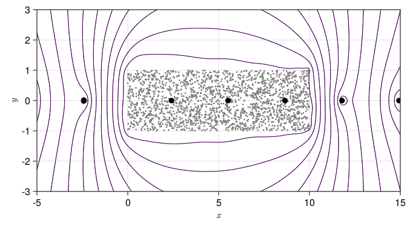
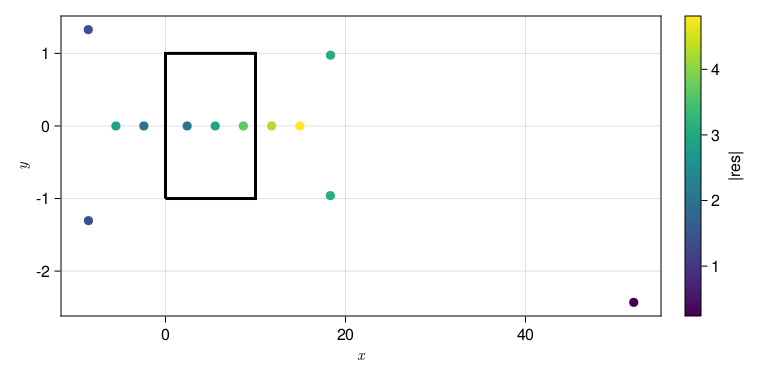

# BaryRational

[](https://github.com/macd/BaryRational.jl/actions)

"You want poles with that?"

This small package contains both one dimensional barycentric rational
approximation, using the AAA algorithm [[1]](#ref1), and one dimensional
barycentric rational interpolation with the Floater-Hormann weights
[[2]](#ref2). It can also calculate the derivatives using the algorithm from [[3]](#ref3).

The AAA approximation algorithm can model the poles of a function, if
present. The FH interpolation is guaranteed to not contain any poles 
inside of the interpolation interval.

## Usage

```julia
julia> using BaryRational
julia> x = [-3.0:0.1:3.0;];
julia> f = x -> sin(x) + 2exp(x)
julia> fh = FHInterp(x, f.(x), order=8, grid=true)
julia> fh(1.23)
7.78493669233287
julia> deriv(fh, 1.23)  # use deriv(fh, 1.23, m=2) for higher order derivatives
7.176696799673523
```
    
Note that the default order is 0. The best choice of the order
parameter appears to be dependent on the number of points (see Table 2
of [[1]](#ref1)) So for smaller data sets, `order=3` or `order=4` can be good
choices. However, if you need more accurate derivatives, you may need
to go to higher, as we did with `order=8` above. This algorithm is not
adaptive so you will have to try and see what works best for you.

If you know that the `x` points are on an even grid, use `grid=true`.

For approximation using `aaa`:

```julia
julia> a = aaa(x, f.(x))
julia> a(1.23)
7.784947874510929
julia> deriv(a, 1.23)
7.17669679970369
julia> deriv(a, 1.23, m=3)
6.508221345462802
```
    
and finally the exact results

```julia
julia> f(1.23)
7.784947874511044
julia> df = x -> cos(x) + 2exp(x)
julia> df(1.23)
7.1766967997038495
julia> df3 = x -> -cos(x) + 2exp(x)
julia> df3(1.23)
6.508221345454844
```

The AAA algorithm is adaptive in the subset of support points that it
chooses to use.

**NOTE:** The aaa approximant is designed to take a scalar or vector input without
broadcasting. It will still give the correct results if you inadvertently 
use a.(xx), but it will be much slower than using a(xx).

**NOTE:**  ForwardDiff does not play well with BaryRational because when we interpolate at
a support point, we just return the initial function value there. ForwardDiff recognizes
this as a constant and returns derivative of a constant, which is zero. There is 
special handling in the algorithm of [3] for calculating the derivatives at support points
and that is implemented here.

## Examples

Here is an example of fitting `f(x) = abs(x)` with both FH and AAA. Note
that because the first derivative is discontinuous at `x = 0`, we can
achieve only linear convergence. (Note that systems like [Chebfun](https://www.chebfun.org/) and
[ApproxFun](https://github.com/JuliaApproximation/ApproxFun.jl) engineer around this by breaking up the interval at the
points of discontinuity.)  While the convergence order is the same for
both algorithms, we see that the AAA has an error that is about a factor
of 1.6 smaller than the Floater-Hormann scheme.

```julia
using PyPlot
using BaryRational
function plt_err_abs_x()
    pts = [40, 80, 160, 320, 640]
    fh_err = Float64[]
    aaa_err = Float64[]
    order = 3
    for p in pts
        xx = collect(range(-5.0, 5.0, length=2p - 1))
        xi = xx[1:2:end]
        xt = xx[2:2:end]
        yy = abs.(xi)
        fa = aaa(xi, yy)
        fh = FHInterp(xi, yy, order=order, grid=true)
        push!(aaa_err, maximum(abs.(fa(xt) .- abs.(xt))))
        push!(fh_err, maximum(abs.(fh.(xt) .- abs.(xt))))
    end
    plot(log.(pts), log.(fh_err), ".-", label="FH Error")
    plot(log.(pts), log.(aaa_err), ".-", label="AAA Error")
    xlabel("Log(Number of points)")
    ylabel("Log(Error)")
    legend()
    axis("equal")
    title("Error in approximating Abs(x)")
end
plt_err_abs_x()
```


Since both of these can approximate / interpolate on regular as well as irregular grid
points, they can be used to create [ApproxFun](https://github.com/JuliaApproximation/ApproxFun.jl) `Fun`'s. ApproxFun needs to be able to evaluate,
or have evaluated, a function on the Chebyshev points (1st kind here, 2nd kind for Chebfun),
mostly if you have function values on a regular grid you are out of luck. Instead, use the
AAA approximation algorithm to generate an approximation, use that to generate the values on
the Chebyshev grid, use `ApproxFun.transform` to transform the function values to coefficients
and then construct the `Fun`. The following shows how.

```julia
using LinearAlgebra
using ApproxFun
import BaryRational as br

# our function
f(x) = tanh(4x - 1)

# a regular grid
xx = [-1.0:0.01:1.0;];

# and evaluated on a regular grid
yy = f.(xx);

# and then approximated with AAA
faaa = br.aaa(xx, yy);

# but ApproxFun needs to be evaluated on the Chebyshev points
S = Chebyshev();
n = 129
pts = points(S, n);

# construct the Fun using the aaa approximation on the Chebyshev points
pn = Fun(S, ApproxFun.transform(S, faaa(pts)));

# now compare it to the "native" fun
x = Fun();
fapx = tanh(4x - 1);
println(norm(fapx - pn))
```

which yields an error norm of `3.0186087174306446e-14`. Pretty nice.

As a final example, you can directly use the `bary()`, the barycentric 
interpolation formula, directly. In this case, it's really advised to use the
Chebyshev points. Here is an example where we use the `Float128` type from the
[Quadmath](https://github.com/JuliaMath/Quadmath.jl) package:

```julia
using Quadmath
using BaryRational
using SpecialFunctions
T = Float128;
B = BigFloat;
num_points = 64;
# Test on the interval [-10.0, 0.0] where airyai is oscillatory
# and yet too small for asymptotic formulas to work.
# Create Chebyshev points and move to [-10.0, 0.0] interval
xx = T(5) * (chebpts(num_points, T) .- T(1));
# airyai does not work with Float128 but is OK with BigFloat
xb = B(5) * (chebpts(num_points, B) .- B(1));
fb = airyai.(xb);
f  = T.(fb);
# Random points for testing
xrat = rand(-10//1:1//100:0//1, 1000);
yb  = bary.(T.(xrat), (f,), (xx,));
ya  = airyai.(B.(xrat));
err = norm(yb - ya, Inf);
println("maximum error: ", T(err))

maximum error: 7.04169792675801867421523999050212504e-32
```

Which is also a nice result.

### Poles 

The function `aaa`, unlike in Chebfun, does not return the poles, zeros, and residues along with the approximant. To extract these, you need to use the `prz` function.

As an example, let us consider approximating $f(z) = 1/J_0(z)$ from random data in a rectangle in the complex plane, reproducing Figure 6.8 of [[1]](#ref1).

```julia
using BaryRational
using StableRNGs
using CairoMakie
using Bessels

## Setup the data
seed = 7174444532485057091
rng = StableRNG(seed)
n = 2000
x = 10rand(rng, n)
y = 2rand(rng, n) .- 1
z = complex.(x, y)
f = z -> inv(besselj0(z))
fz = f.(z)

## Get the approximant and extract the poles and residues 
r = aaa(z, fz)
pol, res, zer = prz(r)

## Plot the error contours together with the data and computed poles
gridx = LinRange(-5, 15, 250)
gridy = LinRange(-3, 3, 250)
err = [abs(f(complex(x, y)) - r(complex(x, y))) for x in gridx, y in gridy]
fig = Figure()
ax = Axis(fig[1, 1], xlabel=L"x", ylabel=L"y", width=600, height=300)
contour!(ax, gridx, gridy, err, levels=10.0 .^ (-12:-1))
scatter!(ax, real(z), imag(z), color=:grey, markersize=4)
scatter!(ax, real(pol), imag(pol), color=:black, markersize=13)
xlims!(ax, -5, 15)
ylims!(ax, -3, 3)
resize_to_layout!(fig)
fig
```



We see that the computed poles of the solution, shown as black dots, are all real, even though we imposed no symmetry in our initial data - an impressive feature of the AAA algorithm. Moreover, these black dots are almost exactly equal to the true poles of $f$, i.e. the zeros of $J_0(z)$, again showing the power of the algorithm. Some of the poles do have some imaginary parts, though:

```julia
fig = Figure()
ax = Axis(fig[1, 1], xlabel=L"x", ylabel=L"y", width=600, height=300)
sc = scatter!(ax, real(pol), imag(pol), markersize=13, color=abs.(res))
lines!(ax, [0, 10, 10, 0, 0], [-1, -1, 1, 1, -1], linewidth=3, color=:black)
Colorbar(fig[1, 2], sc, label="|res|")
resize_to_layout!(fig)
fig
```



Those that are away from the real line are far from the original domain of the data, though, or have small residues, as shown.

## References

<a name="ref1"></a>[1] [The AAA algorithm for rational approximation](http://arxiv.org/abs/1612.00337)

<a name="ref2"></a>[2] [Barycentric rational interpolation with no poles and high rates of approximation](https://citeseerx.ist.psu.edu/viewdoc/download?doi=10.1.1.475.3902&rep=rep1&type=pdf)

<a name="ref3"></a>[3] [Some New Aspects of Rational Interpolation](https://www.ams.org/journals/mcom/1986-47-175/S0025-5718-1986-0842136-8/S0025-5718-1986-0842136-8.pdf)
